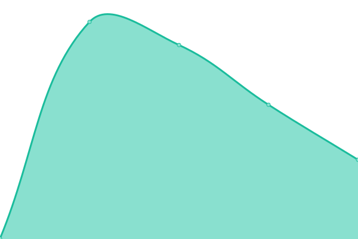
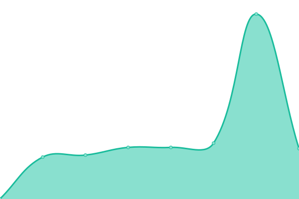
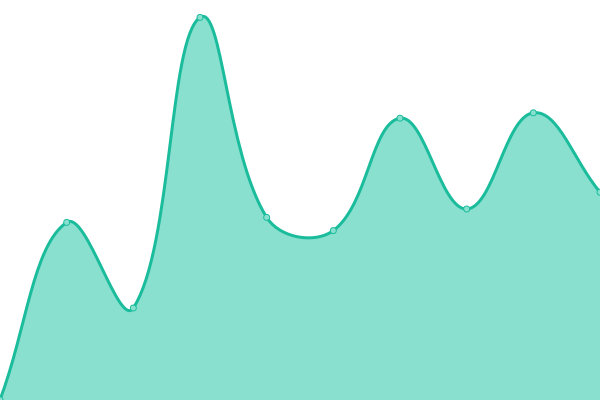
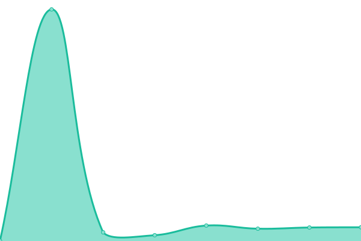

# [📈 Live Status](https://up.w-ss.io): <!--live status--> **🟧 Partial outage**

This repository contains the open-source uptime monitor and status page for [Salvydas Lukosius](https://sall.w-ss.io), powered by [Upptime](https://github.com/upptime/upptime).

With [Upptime](https://upptime.js.org), you can get your own unlimited and free uptime monitor and status page, powered entirely by a GitHub repository. We use [Issues](https://github.com/ss-o/upptime/issues) as incident reports, [Actions](https://github.com/ss-o/upptime/actions) as uptime monitors, and [Pages](https://up.w-ss.io) for the status page.

<!--start: status pages-->
<!-- This summary is generated by Upptime (https://github.com/upptime/upptime) -->
<!-- Do not edit this manually, your changes will be overwritten -->
<!-- prettier-ignore -->
| URL | Status | History | Response Time | Uptime |
| --- | ------ | ------- | ------------- | ------ |
|  Code | 🟥 Down | [code.yml](https://github.com/ss-o/upptime/commits/HEAD/history/code.yml) | 

 649ms
     
 | 

<a href="https://up.w-ss.io/history/code">100.00%</a>
    

|  Digital-link | 🟥 Down | [digital-link.yml](https://github.com/ss-o/upptime/commits/HEAD/history/digital-link.yml) | 

 504ms
     
 | 

<a href="https://up.w-ss.io/history/digital-link">100.00%</a>
    

|  Files | 🟥 Down | [files.yml](https://github.com/ss-o/upptime/commits/HEAD/history/files.yml) | 

 483ms
     
 | 

<a href="https://up.w-ss.io/history/files">100.00%</a>
    

|  Portainer | 🟩 Up | [portainer.yml](https://github.com/ss-o/upptime/commits/HEAD/history/portainer.yml) | 

 405ms
     
 | 

<a href="https://up.w-ss.io/history/portainer">100.00%</a>
    

|  Yacht | 🟥 Down | [yacht.yml](https://github.com/ss-o/upptime/commits/HEAD/history/yacht.yml) | 

 672ms
     
 | 

<a href="https://up.w-ss.io/history/yacht">100.00%</a>
    

|  Ghost | 🟥 Down | [ghost.yml](https://github.com/ss-o/upptime/commits/HEAD/history/ghost.yml) | 

 905ms
     
 | 

<a href="https://up.w-ss.io/history/ghost">100.00%</a>
    

|  Heimdall | 🟥 Down | [heimdall.yml](https://github.com/ss-o/upptime/commits/HEAD/history/heimdall.yml) | 

 390ms
     
 | 

<a href="https://up.w-ss.io/history/heimdall">100.00%</a>
    

|  Home | 🟥 Down | [home.yml](https://github.com/ss-o/upptime/commits/HEAD/history/home.yml) | 

 146ms
     
 | 

<a href="https://up.w-ss.io/history/home">100.00%</a>
    

|  Jellyfin | 🟥 Down | [jellyfin.yml](https://github.com/ss-o/upptime/commits/HEAD/history/jellyfin.yml) | 

 557ms
     
 | 

<a href="https://up.w-ss.io/history/jellyfin">100.00%</a>
    

|  Navidrome | 🟥 Down | [navidrome.yml](https://github.com/ss-o/upptime/commits/HEAD/history/navidrome.yml) | 

 592ms
     
 | 

<a href="https://up.w-ss.io/history/navidrome">100.00%</a>
    

|  Do | 🟥 Down | [do.yml](https://github.com/ss-o/upptime/commits/HEAD/history/do.yml) | 

 0ms
     
 | 

<a href="https://up.w-ss.io/history/do">100.00%</a>
    

|  [HEAD](https://get-digital.link) | 🟥 Down | [head.yml](https://github.com/ss-o/upptime/commits/HEAD/history/head.yml) | 

 274ms
     
 | 

<a href="https://up.w-ss.io/history/head">100.00%</a>
    

|  [TCP ping](1.1.1.1) | 🟩 Up | [tcp-ping.yml](https://github.com/ss-o/upptime/commits/HEAD/history/tcp-ping.yml) | 

 36ms
     
 | 

<a href="https://up.w-ss.io/history/tcp-ping">100.00%</a>
    

<!--end: status pages-->

[**Visit our status website →**](https://up.w-ss.io)

## 📄 License

- Powered by: [Upptime](https://github.com/upptime/upptime)
- Code: [MIT](./LICENSE) © [Salvydas Lukosius](https://sall.w-ss.io)
- Data in the `./history` directory: [Open Database License](https://opendatacommons.org/licenses/odbl/1-0/)
