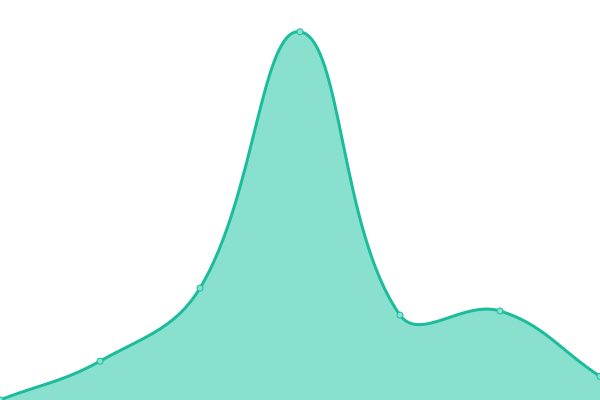

# [📈 Live Status](https://up.w-ss.io): <!--live status--> **🟧 Partial outage**

This repository contains the open-source uptime monitor and status page for [Salvydas Lukosius](https://sall.w-ss.io), powered by [Upptime](https://github.com/upptime/upptime).

With [Upptime](https://upptime.js.org), you can get your own unlimited and free uptime monitor and status page, powered entirely by a GitHub repository. We use [Issues](https://github.com/ss-o/upptime/issues) as incident reports, [Actions](https://github.com/ss-o/upptime/actions) as uptime monitors, and [Pages](https://up.w-ss.io) for the status page.

<!--start: status pages-->
<!-- This summary is generated by Upptime (https://github.com/upptime/upptime) -->
<!-- Do not edit this manually, your changes will be overwritten -->
<!-- prettier-ignore -->
| URL | Status | History | Response Time | Uptime |
| --- | ------ | ------- | ------------- | ------ |
|  MANAGER | 🟥 Down | [manager.yml](https://github.com/ss-o/upptime/commits/HEAD/history/manager.yml) | 

 0ms
     
 | 

<a href="https://up.w-ss.io/history/manager">100.00%</a>
    

|  DIGITAL_LINK | 🟥 Down | [digital-link.yml](https://github.com/ss-o/upptime/commits/HEAD/history/digital-link.yml) | 

 0ms
     
 | 

<a href="https://up.w-ss.io/history/digital-link">100.00%</a>
    

|  DIGITALS SERVER | 🟥 Down | [digitals-server.yml](https://github.com/ss-o/upptime/commits/HEAD/history/digitals-server.yml) | 

 1076ms
     
 | 

<a href="https://up.w-ss.io/history/digitals-server">100.00%</a>
    

|  DPI | 🟥 Down | [dpi.yml](https://github.com/ss-o/upptime/commits/HEAD/history/dpi.yml) | 

 0ms
     
 | 

<a href="https://up.w-ss.io/history/dpi">100.00%</a>
    

|  [TCP ping](1.1.1.1) | 🟩 Up | [tcp-ping.yml](https://github.com/ss-o/upptime/commits/HEAD/history/tcp-ping.yml) | 

 55ms
     
 | 

<a href="https://up.w-ss.io/history/tcp-ping">100.00%</a>
    

<!--end: status pages-->

[**Visit our status website →**](https://up.w-ss.io)

## 📄 License

- Powered by: [Upptime](https://github.com/upptime/upptime)
- Code: [MIT](./LICENSE) © [Salvydas Lukosius](https://sall.w-ss.io)
- Data in the `./history` directory: [Open Database License](https://opendatacommons.org/licenses/odbl/1-0/)
